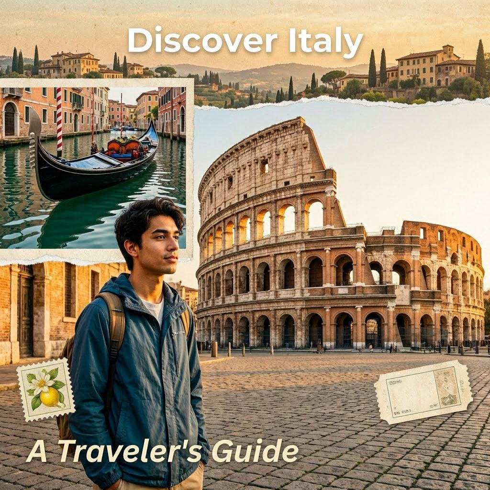

# 01 - Bing Images e DALL-E

## 📝 Resumo da Aula

Nesta aula, o foco é explorar o funcionamento das IAs multimodais voltadas para a geração de imagens, com destaque para o uso prático do Bing Images e do DALL-E 3.

* **Modelos Multimodais e Bing Images:** IAs multimodais processam diferentes tipos de dados (texto, imagem e vídeo) simultaneamente. O Bing Images surge como uma ferramenta gratuita e acessível que utiliza a tecnologia do DALL-E para transformar descrições naturais em múltiplas variações visuais.
* **Geração Contextual no DALL-E 3:** A integração da IA de imagem com chatbots (como o ChatGPT) permite criar artes baseadas no histórico da conversa. Isso possibilita refinamentos iterativos, onde o usuário pode solicitar alterações específicas, como mudar o foco da cena ou remover elementos, sem precisar repetir todas as instruções.
* **Conclusão principal:** a geração de imagens por IA agiliza a produção de materiais visuais para marketing e blogs, mas o sucesso do resultado depende da clareza dos comandos e da capacidade do usuário de refinar as criações através de feedback.

## 🔹 Prompt 1: Capa para post sobre viagens à Itália

**Comando:**
`Desenhe uma capa para um post de blog sobre viagens à Itália`

**Resultado:**

## 🔹 Prompt 2: Ilustração para artigo

**Comando:**
`Crie uma imagem para ilustrar esse artigo (Artigo da primeira aula)`

**Resultado:**

## 🔹 Prompt 3: Refinamento com feedback

**Comando:**
`Não gostei. Gere outra imagem, sem a sauna e com mais foco na Itália.`

**Resultado:**

