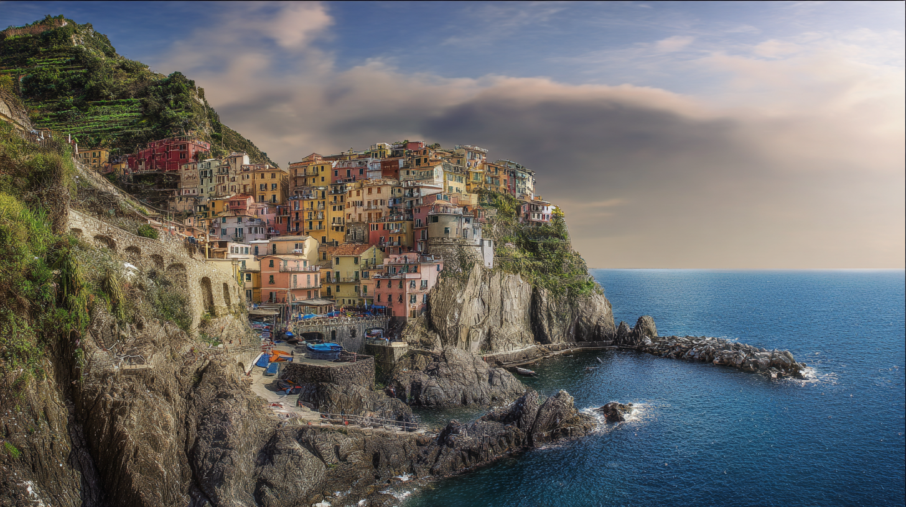

# 02 - Midjourney

## 📝 Resumo da Aula

Nesta aula, o foco é explorar o funcionamento do Midjourney, destacando o acesso à sua nova plataforma web, a configuração técnica de prompts e a personalização de imagens de alta qualidade geradas por IA.

* **Acesso e Nova Interface:** Agora disponível em site próprio (midjourney.com), o acesso exige login via Google ou Discord. A criação de imagens é feita de forma simplificada na aba "Create".
* **Configurações Técnicas:** A interface permite ajustar a versão do modelo (v6.1), velocidade e proporção da imagem (Aspect Ratio), que também pode ser modificada manualmente inserindo comandos como --ar 16:9.
* **Criação e Idioma do Prompt:** A IA gera sempre quatro opções por pedido. O Midjourney compreende o português, mas o uso de prompts em inglês entrega resultados muito mais precisos. Estilos como "fotorrealismo" ou "anime" podem ser livremente adicionados.
* **Plano de Assinatura:** A ferramenta é comercializada de forma majoritariamente paga, oferecendo planos de assinatura mensais ou anuais gerenciados na seção "My Account".
* **Conclusão principal:** o Midjourney se destaca pelo realismo e qualidade visual superior de suas criações, sendo que o sucesso do resultado depende do ajuste correto de proporções, testes de estilos e da preferência por comandos escritos em inglês.

## 🔹 Prompt 1: Paisagem realista da Itália

**Comando:**
`uma paisagem muito realista da Itália`

**Resultado:**

